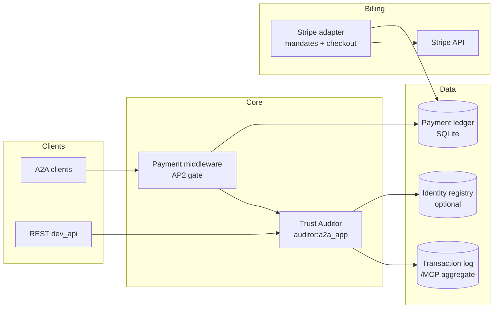

# Architecture (overview)

High-level data flow for the Trust Auditor platform.

## Components

| Piece | Role |
|--------|------|
| **auditor** | ADK agent: `verify_identity`, `audit_reputation`; combines registry + performance → trust score + evidence. |
| **transaction_log** | Records per-agent outcomes; exposes aggregates consumed as MCP-shaped HTTP. |
| **identity_registry** | Optional attestations (`registered`, `operator_verified`, `partner_attested`). |
| **stripe_adapter** | AP2-like gateway: mandates, refunds, Checkout, Billing Portal, webhooks → auditor. |
| **dev_api** | Thin REST for audits/disputes without full A2A client. |

## Trust score (summary)

- **Identity** component from registry quorum (or defaults when unset).
- **Performance** component from `success_rate` over a rolling window (see [TRANSACTION_MODEL.md](TRANSACTION_MODEL.md)).
- Blended **trust score** and **status** with tier rules (`VERIFICATION_TIER`, sample size). Details: `src/auditor.py`.

## Deployment notes

- Default stores use **SQLite** (auditor disputes, payment ledger, adapter mappings). For **horizontal scale**, move to a shared database or constrain adapter to a single Cloud Run instance.
- Production should set **`AGENT_PUBLIC_BASE_URL`** and serve **`/.well-known/agent-card.json`** consistent with the deployed host.
